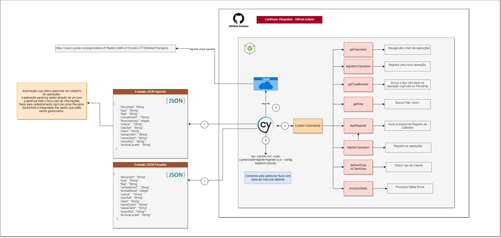
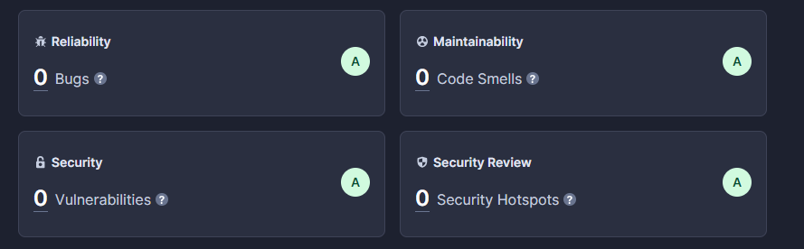
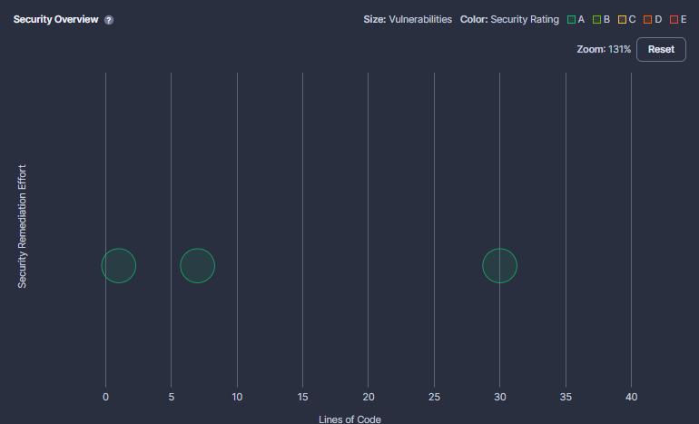
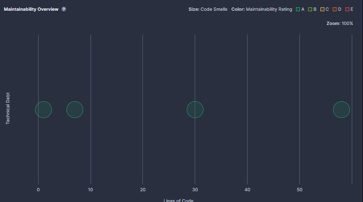
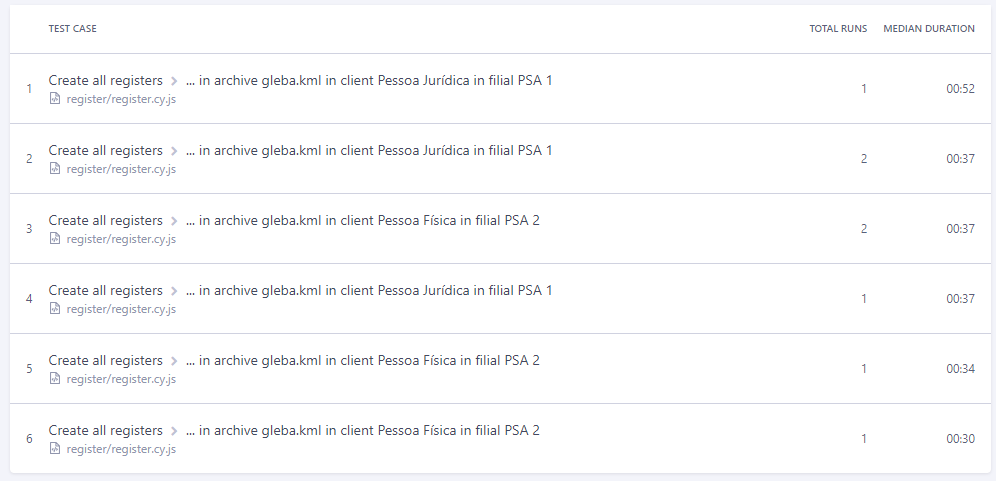
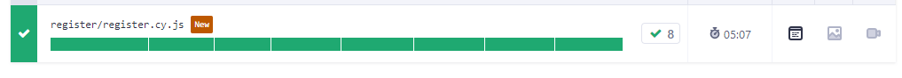
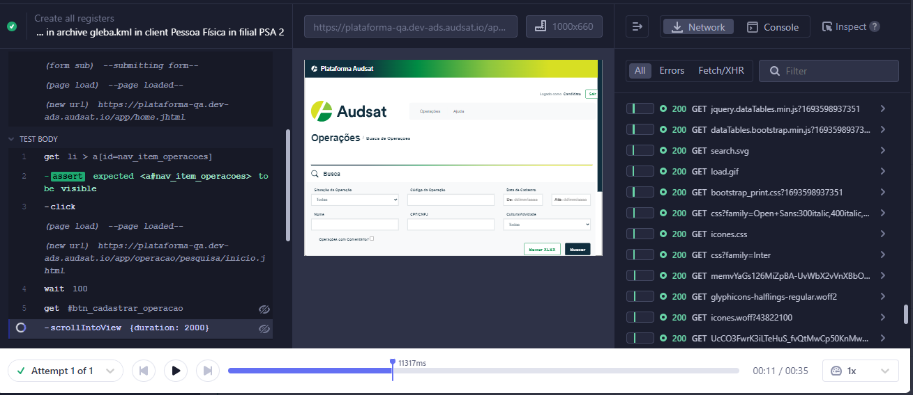

### Automação no Processo de Cadastramentos de Operações Pecuárias e Agrícolas

* O Processo consiste em gerenciar uma operação de cadastramento Pecuária e Agrícola de maneira inteligente, gerenciando dados atraves de arquivos json para maior flexibilidade e escalabilidade dos dados, visando ter diversos cénarios contemplados com menor código e versatilidade das informações.

### Overview Solução

### Recursos Utilizados:

* Node.js 18.12.1 - Servidor da nossa aplicação.
* Cypress 13.1.0 - Biblioteca para criação dos testes automatizados;
* Cypress Dashboard Cloud - Dashboard para metrificar os processos dos testes, com relatórios a cada subida para as branchs de integração contínua;
* GitHub actions - Servidor para Integração continua do nosso código;
* SonarCloud - Ferramenta para Metrificar processos de qualidade ao codigo-fonte, evitando vulnerabilidades, riscos a segurança, cobertura de códigos, duplicações, itens críticos, complexidade cognitiva da aplicação e dentre outros pontos.

### Configurações:

* Com o intuito de permitir a edição das configurações mutáveis da aplicação, há um arquivo de propriedades que correlaciona uma propriedade a um valor, que por sua vez é usado pela aplicação para configurar algum aspecto da mesma, fique a vontade para configuração do arquivo <b>Cypress.env.json</b>.

### Solução:
Visto a necessidade de diversos cadastramentos e cenários para contemplação do processo da operação, foi arquitetado em algumas padrões para melhoria e entendimento do código:  

1. Criação de Custom Commands - Cada comando com sua responsabilidade dentro da aplicação, garantindo o reutilizar de códigos para ambos cenários;

2. Criação de arquivos com dados para serem reutilizados encontrados na pasta <b>fixtures</b> tanto para operações Agrícolas como Pecuárias, com uma lista de informações podendo ser includas ou retiradas, com cada valor correspondendo a um cenário diferente para melhor cobertura da aplicação.

3. Criação de uma função para gerenciamento dos casos de testes, como estamos utilizando padrões Custom, interessante a criação para melhoria das chamadas e polpar processamento.

4. Integração com facilidade com <b>Cypress Dashboard Cloud</b> para a cada código na esteira de CI serem integradas no nosso Dashboard inteligente.

5. Criação de esteira de testes paralelas para workflows de Desenvolvimento e Homologação, com cada código subindo nessas branch os testes serão executados automaticamente, e as métricas vão ser levadas para o dashboard.

### Como utilizar localmente?

Para melhor entendimento foi levado o host para uma configuração global da aplicação, e maior facilidade para quem for utilizar o código, basta seguir os seguintes passos para inicialização:

* npm install - instalar as dependencias com base no arquivo package.json.

* npm run start ou npx cypress open - abrir ambiente cypress.

* npm run register-dev - rodar todos os testes em nivel de desenvolvimento.

### Integrações:

Para acessar os reports do Dashboard cloud para acessar o link, fazer cadastro e acessar a organização pública:

* https://cloud.cypress.io/organizations/57f6a6d3-0090-4115-b3e3-377280d4ed1f/projects

### Reports iniciais:

Reports iniciais gerados, para acessar mais reports e visualização de videos acessar o link acima.

#### SonarCloud Métricas:

Geral:

Relatório de BUGS da app, segurança, manutenabilidade, e itens de segurança.

* Segurança - Padronização Classe A.

* Confiabilidade - Padronizações com alta confiabilidade.

Para acessar mais métricas do projeto com SonarCloud, pode acessar diretamente por:

https://sonarcloud.io/summary/overall?id=GustavoWiessenerC_aut-project

#### Test cases:

#### Report Cases:

### Report de Test Replay:

https://cloud.cypress.io/projects/dofksu/runs/1/test-results/176a1b04-ea61-4ac8-8710-2436f4047d53/replay?att=1

